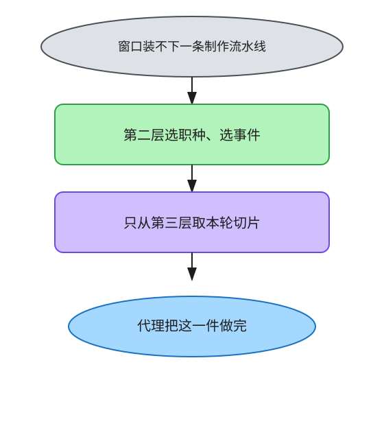
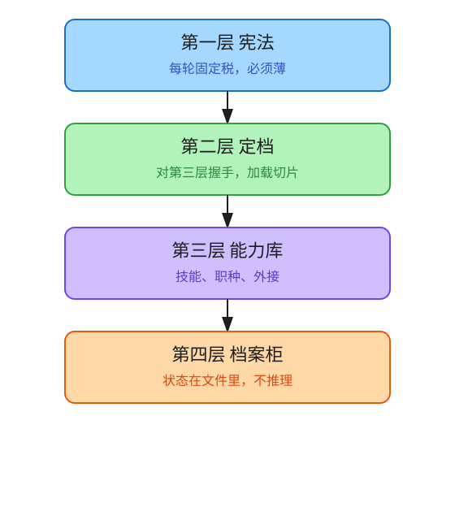
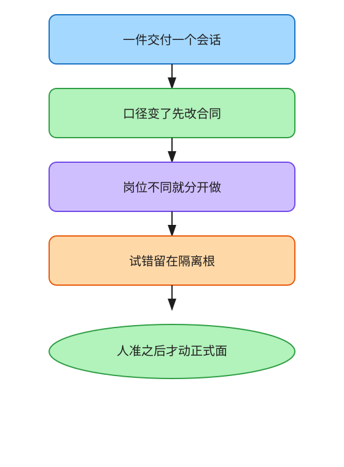
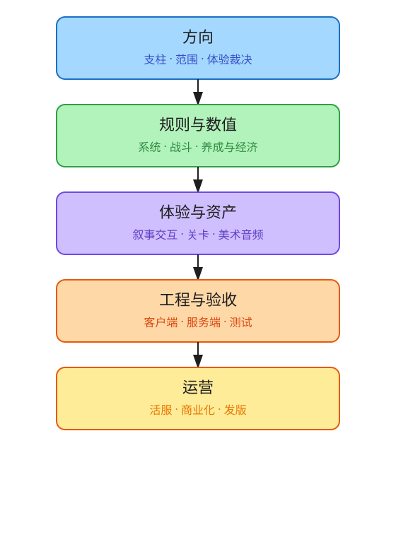

# Game Studio Harness

**给游戏制作代理用的四层编排。** 技能、职种、外接、写隔离，一次装到 Cursor、Claude Code、Codex、Grok、DeepSeek。

[English](#english) · [安装](#安装) · [设计](#设计) · [目录](#目录)

| 职种 | 技能 | 外接 |
| ---: | ---: | ---: |
| 35 | 106 | 36 |

> 窗口是稀缺的。正式面是不可逆的。会话会断。

本仓用封版的四层来管这三件事。它不附带引擎或 DCC。它附带的是一种编排：谁来选上下文、谁来做事、谁来碰正式文件。

---

## 安装

Windows，Python 3.11+。克隆本仓，双击 `一键部署.bat`，填写业务根。

```powershell
.\一键部署.ps1 -Workspace D:\MyStudio
.\一键部署.ps1 -Workspace D:\MyStudio -Tools cursor,claude
```

探测（不写真实用户目录）：

```powershell
python install/install.py --isolate-root D:\probe --workspace D:\probe\ws --tools all
python install/verify_install.py --isolate-root D:\probe --workspace D:\probe\ws
```

已有的 `~/.cursor/mcp.json` 不会被覆盖。本包装架构，不装宿主软件。

---

## 设计

### 专注度

大模型的窗口装不下一条游戏制作流水线。把支柱、数值、关卡、资产、引擎、验收的做法同时塞进去，代理看起来很全能，实际在串岗、抢写、丢掉本轮边界。

我们不靠提示词里的「请专注」。**第二层对第三层握手**：先选职种或事件，再从能力库里只取这一轮用得上的切片。职种是路径，不是清单——点一条岗，先看第一步，走到哪一步再打开哪一份做法。外接同样：开场只握必须握的手，其余用到再拉。

相关性一旦交给模型自己猜，它会为了保险把可能用到的全部打开。握手把相关性收成一个集合。集合小，专注度才可预期。



### 四层

宪法必须每轮都在，所以必须薄。做法必须可复用，所以必须厚。这两件事不能写在同一层。

定档也不能并进能力库。库回答「这件事怎么做」；导演回答「这一轮点谁」。没有导演，库会自己当导演，每轮读完全部技能。

档案柜承认自己不会推理：只记做到哪、正式面在哪、哪句已经批准。口头想法要进库，须人准。

五套编程工具是同一套四层的五份齐套拷贝，不是第五层。落点会变，运转法不该变。



### 任务编排

定档 → 制作 → 结案，解决的是代理会同时做三件有害的事：把可能相关的做法都打开、同时扮演几个岗位、直接改看得到的正式文件。

一件交付一个会话。口径变了，先改合同再换上下文。岗位不同，就按职种分开做——专注度的边界是岗位，不是「请你同时当数值策划和客户端」。试错默认进隔离根；正式面只在人准的那一下，按记录集回写。



### 技能、子代理、外接

三种东西粒度不同，不能合成一种。

**技能**是一件事的做法：定支柱、写伤害公式、过导入校验、出验证结论。当次数字和当次路径不准写进技能。

**子代理（职种）**是一条岗的走法。战斗数值策划从建模走到晋升，关卡策划从目标链走到节奏，测试负责人从计划走到豁免。同一诉求里岗位不同，优先各开一只，主会话只负责点名和收口。

**外接**是宿主的手：改表、进引擎、动 DCC、画图。软件可以不在，架构仍应能转。三十六条外接若开场全连，发现阶段会被空等吃掉；所以默认只让每日要握的手直连，其余懒接。

制作流水线被托住的方式，是每一段都有岗可点、有技能可按步打开、有手可以伸向对应软件：



方向一段，职种是创意总监，技能是支柱、体验批注、砍范围。规则与数值一段，系统策划、战斗策划、三路数值策划各走各的路径，改表的手是表格外接。体验与资产一段，叙事、交互、关卡、原画、绑定、动画、特效、技美、音频各有岗。工程与验收一段，客户端、服务端、工具、测试分开。运营一段，活服、商业化、发版接到日历、活动规格和商店目录。

流水线长，所以更不能把整条灌进一轮。第二层每次只握住其中一段。

---

## 目录

```text
README.md
figures/
cursor/   claude/   codex/   grok/   deepseek/
studio/
install/
一键部署.bat
```

五套工具目录各自齐套，打开就能看完整包。`studio/` 是业务根 `.harness` 模板。`install/` 是安装与验收。

---

## 行为准则

- 密钥不进仓库。外接配置只放占位符。
- 写级别默认沙箱。改正式面前先落到隔离根，晋升须人准且只回写记录集。
- 四层已封版。改架构须先转向、改计划、写决策。
- 口头想法不能冒充已批准事实。

---

## English

A four-layer harness for game-production agents. Skills, crafts, MCP, and write isolation for Cursor, Claude Code, Codex, Grok, and DeepSeek.

The window is scarce. The official surface is irreversible. Sessions break. This repo ships an orchestration: who picks context, who does the work, who touches official files. It does not ship engines or DCC.

Install: clone, run `一键部署.bat`, point at your studio root. The pack installs architecture, not host software.

Design: the second layer handshakes with the third to load only this round's slice. The fourth layer is a filing cabinet, not a knowledge graph. Five harness folders are five complete copies of the same four layers.

MIT.

---

## 许可

MIT。
