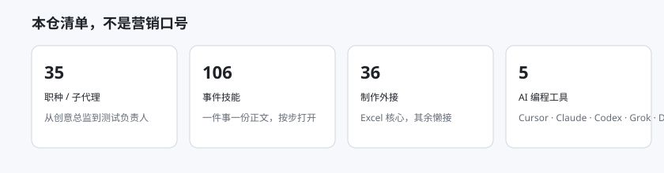
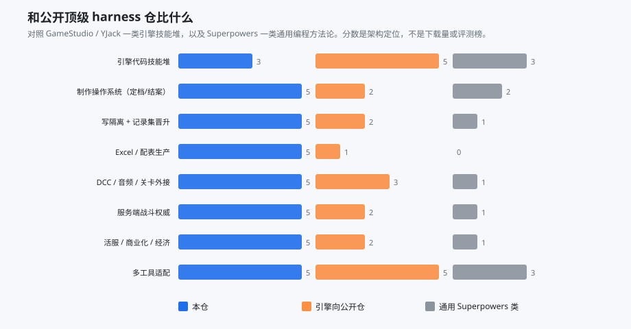
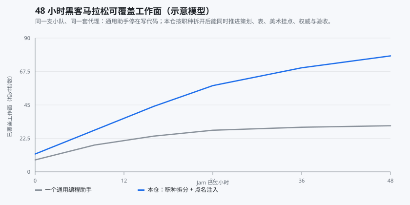

# Game Studio Harness

**把任意一套主流 AI 编程工具，变成能跑完整游戏制作流水线的工作室操作系统。**

不是又一份「把 Unity 教程拆成 Skills」的 Jam 模板。本仓提供的是封版四层制作 OS：定档、点名注入、职种主路径、写隔离、档案柜、外接档位。技能正文只存一份，同时落到 Cursor、Claude Code、OpenAI Codex、Grok Build（grokbot）和 DeepSeek Harness。



| 职种 | 事件技能 | 制作外接 | 适配工具 | 许可 |
| ---: | ---: | ---: | ---: | :---: |
| **35** | **106** | **36** | **5** | MIT |

[自述：用途、优劣势、和公开仓怎么比](自述.md) · [多工具落地对照](docs/适配.md) · [外接要装什么](docs/工具/总览.md) · [一键部署](#一键部署)

---

## 为什么不是又一个 GameStudio 克隆

公开网上已经有很强的引擎向仓，例如 [bullish0x/GameStudio](https://github.com/bullish0x/GameStudio)（55 agents / 182 skills，Godot·Unity·Unreal·WebGL）和 [YJackGameStudio](https://github.com/YvesAlbuquerque/YJackGameStudio)。它们把「会写引擎代码的代理」武装得很厚。

本仓走另一条更难、也更接近真工作室的路：

| 他们通常最厚的地方 | 本仓刻意做厚的地方 |
|---|---|
| 引擎 API、shader、ECS、Web 运行时 | 定档 / 结案 / 现行卡，会话可换人续 |
| 更多 agent 文件、更多 slash command | **点名注入**：106 份技能不会灌进每一轮 |
| 模板 GDD、Jam 脚手架 | **写隔离**：默认沙盒，人准后只回写记录集 |
| 多引擎代码风格 | **配表生产**（Excel COM）、**服务端权威**、**活服与商业化** |
| 单工具或「兼容 AGENTS.md」 | 五套工具的真实家目录，外加共享运行时 `~/.gsh` |



雷达按**本仓清单能力**计分，用来说明覆盖形状，不是第三方评测，也不是 GitHub star 榜。


---

## 一条流水线，九段都能点到岗

黑客马拉松里最常见的失败：一个通用编程助手在 48 小时里只把主程面铺开，策划表、权威服、验收和活动规格全靠人肉补。本仓按职种拆开后，同一套文件能同时推进九段。




35 个职种从创意总监、战斗/经济数值、原画与技美、客户端/服务端战斗，一直到测试五岗和活服/商业化。点职种只打开路径第一步，不预读整条技能。

---

## 架构在压哪三条曲线

下面三张是**架构对比模型**，用来解释取舍。你机器上的秒数取决于宿主和网络。

| 上下文 | 冷启动 | 正式面 |
|---|---|---|
|  |  |  |

- 名单只决定开场注入，不是运行时防火墙。缺的技能过程中再打开。
- 36 条外接默认：Excel 核心直连，其余懒接。缺宿主红灯 **不算** 架构失败。
- 表 / 代码 / 引擎 / 草稿走同一张 `surfaces.json`。晋升须人准。

四层概念（宪法 → 定档 → 能力 → 档案柜）已封版。仓内目录按工具落点分档，不再用 `L1` 搬运夹。详见 [docs/架构.md](docs/架构.md)。

---

## 一键部署

先决：Windows，[Python 3.11+](https://www.python.org/downloads/) 已加入 PATH。再装你实际使用的 AI 编程工具（可只装其中几个）。

1. 克隆本仓。
2. 双击 `一键部署.bat`。
3. 给出**业务根**绝对路径（将创建 `.harness`）。回车则在本仓上一级生成 `studio-root`。
4. 看到 `ok architecture install`。
5. 用你的工具打开那个业务根，改 `<业务根>/.harness/surfaces.json`。

```powershell
.\一键部署.ps1 -Workspace D:\MyStudio
.\一键部署.ps1 -Workspace D:\MyStudio -Tools cursor,claude
.\一键部署.ps1 -CursorOnly -Tools all
```

| 工具 | 家目录 | 宪法文件 | 技能落点 |
|---|---|---|---|
| Cursor | `~/.cursor` | `rules/全局.mdc` | `~/.cursor/skills` |
| Claude Code | `~/.claude` | `CLAUDE.md` | `~/.claude/skills` |
| OpenAI Codex | `~/.codex` | `AGENTS.md` | `~/.agents/skills` |
| Grok Build / grokbot | `~/.grok` | `AGENTS.md` | `~/.grok/skills` |
| DeepSeek Harness | `~/.dsh` | `AGENTS.md` | `~/.dsh/skills` |

共享运行时一律进 `~/.gsh`（菜单、脚本、技能源拷贝）。已有的 `mcp.json` **不会被覆盖**。本包装架构文件，不装 Excel / Unity / Blender / FMOD。软件清单见 [docs/工具/总览.md](docs/工具/总览.md)。

探测安装（不写真实用户目录）：

```powershell
python install.py --isolate-root D:\probe --workspace D:\probe\ws --tools all
python verify_install.py --isolate-root D:\probe --workspace D:\probe\ws
```

---

## 仓内树

```text
cursor/                 唯一正文：规则、技能、职种、钩子、菜单
adapters/               五套工具的落点注册，不是第二套技能
workspace-scaffold/     业务根 .harness 档案柜
docs/图表/              覆盖雷达、对照、Jam、三条风险曲线
docs/工具/              36 条外接要装什么、怎么用
一键部署.bat / .ps1
```

---

## 不进本仓

- DCC / 引擎 / MCP 后端软件、venv、Node 包
- 现网 `mcp.json` 里的绝对路径、账号、密钥
- 任何工作室的表、文案、工程

## 许可

MIT。见 `LICENSE`。
