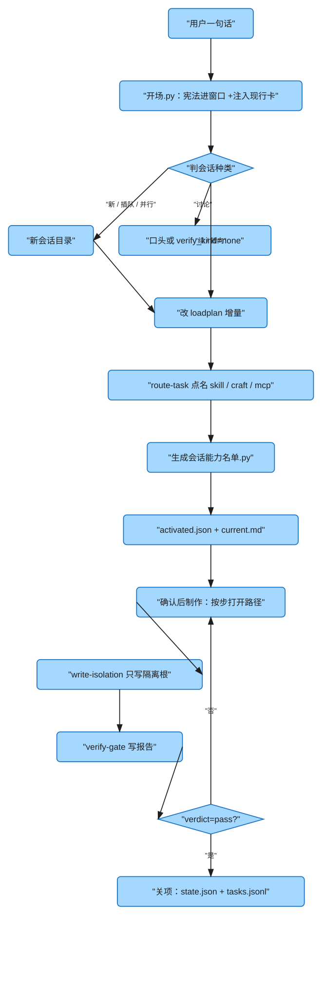
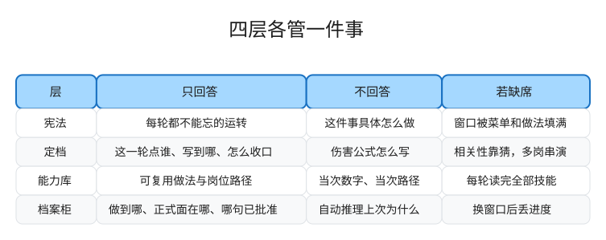
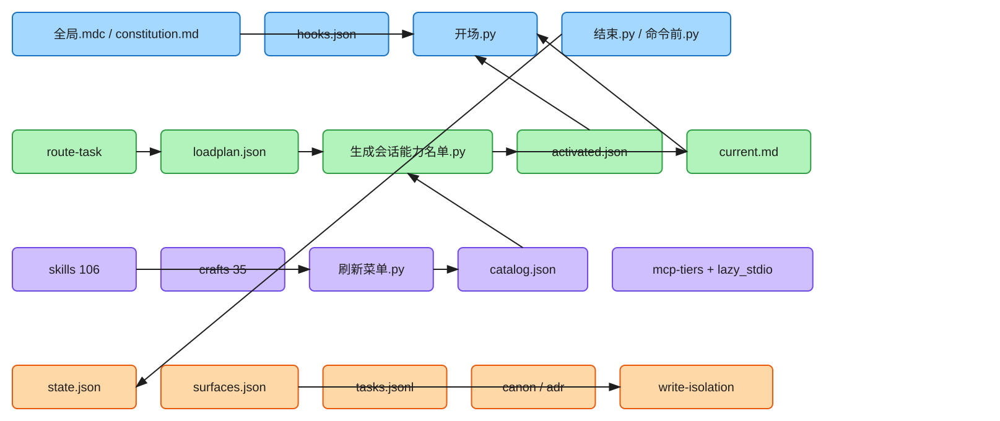
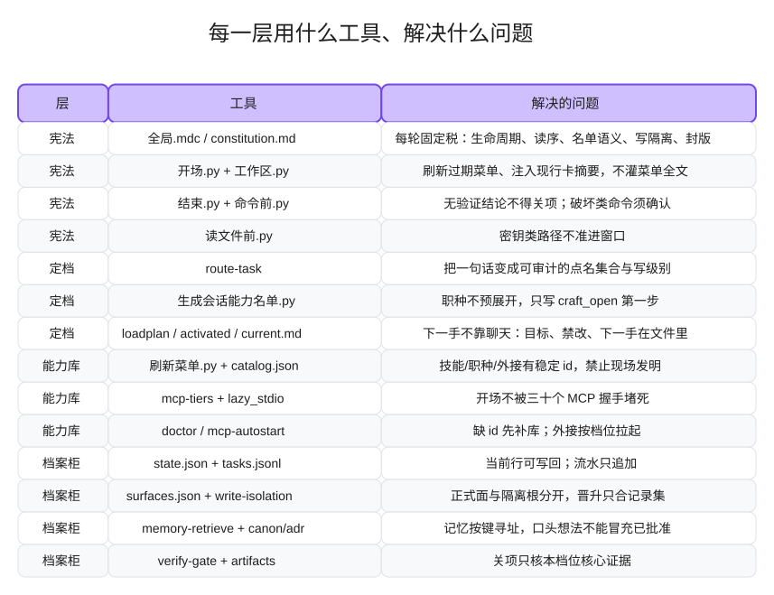
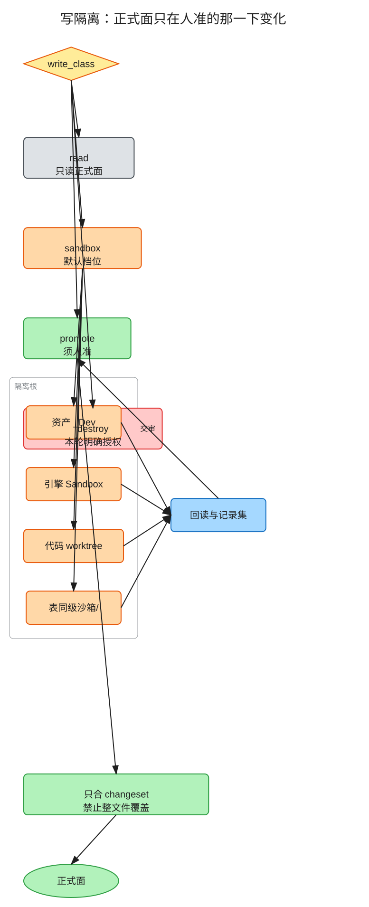
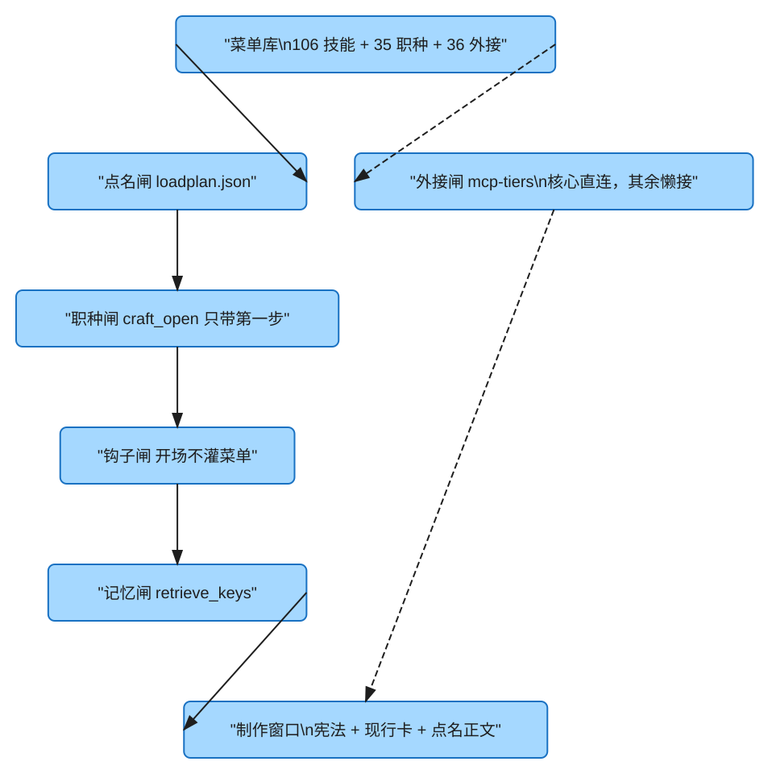

# Game Studio Harness

游戏制作里，代理缺的不是更多技能文件。缺的是三件事被管住：

1. **窗口是稀缺的。** 做法可以有一百份，一轮对话装不下。
2. **正式面是不可逆的。** 表、主仓、引擎内容被整本覆盖，比答错一题贵。
3. **会话会断。** 换人、换窗口、换工具之后，下一手必须能从文件接着做。

本仓是这三件事的操作系统。它不装 Excel、Unity 或任何 DCC。它装的是：每轮读什么、这一轮点谁、做法从哪打开、写到哪、做到哪。四层已经封版。仓根上五套工具目录各自齐套；打开 `cursor/` 或 `claude/` 就能看到完整包。

| 职种 | 技能 | 外接 | 齐套目录 |
| ---: | ---: | ---: | ---: |
| 35 | 106 | 36 | cursor · claude · codex · grok · deepseek |

## 目录

- [它怎么转](#它怎么转)
- [仓根为什么这样排](#仓根为什么这样排)
- [四层各自回答什么](#四层各自回答什么)
- [第一层：宪法](#第一层宪法始终生效所以必须拒绝变厚)
- [第二层：定档](#第二层定档导演不是又一个工人)
- [第三层：能力库](#第三层能力库做法在库里注入在名单里)
- [第四层：档案柜](#第四层档案柜承认自己不会推理)
- [五道闸怎么合成专注度](#五道闸怎么合成专注度)
- [能力库里有什么](#能力库里有什么)
- [五套工具目录](#五套工具目录)
- [一键部署](#一键部署)
- [许可](#许可)

---

## 它怎么转

打开一次会话，代理不是先写文件。宿主先跑开场钩子：菜单过期则刷新，外接按档位探活，再把**现行卡摘要**推进窗口。然后读序是一条链，顺序就是优先级：

宪法 → 现行卡 → 点名的技能 / 职种正文 → 计划里 `retrieve_keys` 命中的已批准事实。

它不会把菜单全文、106 份技能或职种整条路径先读一遍。

用户一句话之后，导演技能 `route-task` 复述目标、交付、边界和写级别，写成 `loadplan.json`。生成脚本对照菜单产出 `activated.json` 和 `current.md`。职种只带路径第一步。名单确认后再制作。

制作默认只写隔离根。结案必须有验证报告，且 `verdict` 为通过。结束钩子和命令前钩子会挡住「口头说完了」。



源文件可拖到 [excalidraw.com](https://excalidraw.com) 继续改：`docs/figures/会话生命周期.excalidraw`。

---

## 仓根为什么这样排

仓根本身不是给 Codex / Claude 读的业务根。它是**安装包**。所以外层只留入口、五套齐套目录、业务根模板、图和安装器。

```text
README.md                 本文件：架构含义、每层工具、部署
LICENSE
.gitignore
一键部署.bat / .ps1        本机入口
cursor/                   Cursor 完整包
claude/                   Claude Code 完整包
codex/                    Codex 完整包
grok/                     Grok Build 完整包
deepseek/                 DeepSeek Harness 完整包
studio/                   业务根 .harness 模板
docs/figures/             Excalidraw 源文件与 SVG
docs/tools/               外接宿主软件（不是第四层、也不是架构层）
scripts/                  安装与验收
```

**不在仓根放 `AGENTS.md` / `CLAUDE.md`。** 那两份是各工具家目录和业务根安装之后的入口：Claude 读 `~/.claude/CLAUDE.md`，Codex 读 `~/.codex/AGENTS.md`，业务根安装后也会各写一份给打开工作室的代理看。把它们堆在安装包外层，等于让打开本仓的代理把「部署仓库」误认成「正在做的游戏项目」。

五套目录内部的 `constitution.md` / `CLAUDE.md` / `AGENTS.md` 必须留着：那是装到家目录之后的宪法，不是本仓外壳。

---

## 四层各自回答什么

若合成三层，常见塌法是：宪法里塞做法，或做法目录自己当导演。结果是每轮读完全部技能，或者没有人负责「这一轮到底点谁」。

若拆成五层以上，多出来的往往只是落点名字。落点会变（Cursor 的规则文件、Claude 的 `CLAUDE.md`、Codex 的 `AGENTS.md`），运转法不该变。所以五套工具目录是**同一套四层的五份齐套拷贝**，不是第五层。



| 层 | 只回答 | 不回答 | 若缺席 |
|---|---|---|---|
| 宪法 | 无论做什么都不能忘的运转 | 这件事具体怎么做 | 窗口被菜单和做法填满 |
| 定档 | 这一轮点谁、写到哪、怎么收口 | 伤害公式怎么写 | 相关性靠猜，多岗串演 |
| 能力库 | 可复用做法和岗位路径 | 当次数字、当次路径 | 每轮读完全部技能 |
| 档案柜 | 做到哪、正式面在哪、哪句已批准 | 自动推理「上次为什么」 | 换窗口后丢进度 |

封版：任务再多，也不许沿旧名单再加一层来「顺便」解决问题。要改分层，先转向、改计划、写决策。





---

## 第一层：宪法。始终生效，所以必须拒绝变厚

第一层每轮都会进窗口。写进去的每一段都是**固定税**。税越重，留给本轮做法的预算越少。这一层的设计动作主要是拒绝：

- 拒绝把技能步骤写进宪法。
- 拒绝把菜单、职种列表、外接工具表当开场读物。
- 拒绝把当次项目名、当次数字写进可复用正文。

留下的只有运转不变量：生命周期（定档 → 制作 → 结案）、开场读序、名单语义、会话种类、写隔离、封版。

### 这一层用什么工具、解决什么问题

| 工具 | 落在哪 | 解决什么问题 |
|---|---|---|
| `cursor/rules/全局.mdc` | Cursor 始终生效规则 | 把宪法钉进 Cursor 每一轮，不依赖有没有打开技能文件 |
| `constitution.md` | 五套目录各一份 | 给 Claude / Codex / Grok / DeepSeek 同一份宪法；安装器也用它生成家目录入口 |
| `hooks.json` | 仅 Cursor | 把钩子挂到 `sessionStart` / `stop` / `beforeShellExecution` / `beforeReadFile`。没有这张表，宪法只是文章 |
| `hooks/开场.py` | 会话开始 | 菜单过期则刷新；按档位探活外接；注入读序、现行卡摘要、点名列表。**不灌菜单全文** |
| `hooks/工作区.py` | 被其它钩子引用 | 从 cwd / 环境变量找到带 `.harness` 的业务根；以 `sessions/LATEST` 为准定位当前会话；拼出 `HARNESS_*` 环境变量 |
| `hooks/结束.py` | 会话结束且状态为 completed | 没有 `verdict=pass` 的验证报告，就不许宣称完成；缺现行卡则提示交接 |
| `hooks/命令前.py` | 跑 shell 之前 | 强推、硬重置、清空未跟踪必须确认；关项类命令先读验证结论 |
| `hooks/读文件前.py` | 读文件进模型之前 | `.env`、密钥、私钥路径不准进窗口。密钥留在密钥管理处 |
| `hooks/数据就绪预检.py` | 改表 / 模拟前可调 | 框架簿路径只来自环境变量和正式面地图，防止对空表开算 |
| `hooks/校验验证报告.py` | 结束钩子引用 | 报告缺字段就不算通过，防止口头绿 |
| `hooks/建议执行单.py` | 转给脚本 | Cursor 钩子目录里的薄委托，权威在 harness 脚本 |

其它四套工具没有 Cursor 钩子运行时。它们靠各自的宪法文件守同一套读序和名单语义；安装后共享运行时 `~/.gsh` 里仍是同一批脚本。

开场读序写成一条链，是因为倒过来会被技能细节带走，丢掉本轮边界：先稳住「怎么运转」和「正在做哪件」，再打开做法，最后按键取已批准事实。

---

## 第二层：定档。导演，不是又一个工人

不经定档时，模型会做三件有害的事：把「可能相关」的做法都打开、同时扮演几个岗位、直接改它看得到的正式文件。

第二层把「相关性」从模型猜测改成**显式集合**。导演不生产业务文件。它只决定：目标是什么、点哪些 id、写级别是什么、下一手看哪张卡。

### 这一层用什么工具、解决什么问题

| 工具 | 落在哪 | 解决什么问题 |
|---|---|---|
| `route-task` | 技能 | 接到一句话：复述目标与边界、对照菜单点名、定档位与写级别、写加载计划、生成名单。不清先问 |
| `assemble-craft-flow` | 技能 | 计划里已经有多个事件时，按菜单推荐序排出执行单，避免「想到哪做到哪」 |
| `collab-protocol` | 技能 | 关键分叉给选项、分段推进；正式路径写入前先获准 |
| `生成会话能力名单.py` | harness 脚本 | 读 `loadplan.json` + `catalog.json`，写出 `activated.json` 和现行卡。职种**不预展开** `uses_skills`，只写 `craft_open`（路径第一步）。已点名 skill 的 `needs_mcp` 并入 `mcp_allow` |
| `项目库.py` | harness 脚本 | 写现行卡、写回当前行 `state.json`、往 `tasks.jsonl` 追加一行。日期只进当前行和流水 |
| `建议执行单.py` | harness 脚本 | 多事件时产出 `flow.json`：执行类在前，收口类在后 |
| `loadplan.json` | `.harness/sessions/<短名>/` | 本轮合同。必填 `session_id` `tier` `items` `verify_kind` `intent` `work_mode`；建议 `write_class` `retrieve_keys` `forbid`。每一项 `why` ≥ 8 字 |
| `activated.json` | 同目录 | 开场注入切片。**只回答「先读谁」，不是运行时防火墙** |
| `current.md` | 同目录 | 下一手不靠聊天：目标、进度、写级别、正式面、隔离根、禁改、下一手 |
| `sessions/LATEST` | 会话目录 | 当前会话指针。探测会话不写进指针 |

点名有硬约束，因为计划里每一项都是开场税：

- 一件事一个主事件，**或**一条职种主路径，二者只取其一。
- 外接只点开场必须握手的。过程中新用到的直接调，不必为放行改计划。
- 菜单没有 id：先补能力（`doctor`），再定档。不现场发明 id。

职种正文是**路径（序列）**。若把 `uses_skills` 一次性写入名单，代理会同时用第一步和最后一步的口径说话。所以点职种只注入职种正文 + `craft_open`。做到那一步，再打开那份技能。

`tier` 决定结案核多少证据，不决定开场读多少技能。岗位不同时按职种开子代理：专注度的边界是岗位，不是提示词里的「请专注」。主会话点名和收口。

### 会话种类保护的是上下文集合

| 意图 | 何时 | 会话怎么处理 | 名单 |
|---|---|---|---|
| 续 | 同一聊天、同一未关交付 | 同目录 | 计划可不动，或增量点名后再生成 |
| 转向 | 同一件、口径变了 | 同目录 | **先改计划再动手**，禁止沿旧名单做完 |
| 插队 | 上一件未完，先做另一件 | 新目录做新件 | 旧件不关，进度写已停 |
| 新 | 另一件交付 | 新目录 | 按档位重写 |
| 并行 | 两件互不依赖 | 各件各目录；岗位不同开子代理 | 各卡各名单 |
| 讨论 | 只要选项 | 口头或 `verify_kind=none` | 可以点名，但不写验证报告 |

---

## 第三层：能力库。做法在库里，注入在名单里

106 份技能、35 条职种、36 条外接是**库**。开场读的是库的一个切片。

`activated.json` 只回答「开场先注入谁」。过程中缺技能就当场打开，缺外接就当场调用。若做成运行时硬闸，导演会被迫预点「可能用到的一切」，第一层的薄就被废掉。

| | 开场 | 过程中 |
|---|---|---|
| 技能 / 职种 | 只读点名 | 可再打开 |
| 外接 | 只提示 `mcp_allow` | 可再调用 |
| 记忆 | 只读 `retrieve_keys` 命中 | 新事实先写产物，批准后再进 canon |

三种粒度不能合成一种：

- **技能**是一件事的做法（怎么改表、怎么验关项）。
- **职种**是一条岗的走法（战斗数值策划从建模走到晋升）。
- **外接**是宿主的手（Excel COM、引擎、DCC）。软件可以不在，架构仍应能转。

### 这一层用什么工具、解决什么问题

| 工具 | 落在哪 | 解决什么问题 |
|---|---|---|
| `skills/*/SKILL.md` | 五套目录各一份 | 可复用做法。当次数字、当次路径不准写进技能正文 |
| `agents/*.md` | 五套目录各一份 | 职种主路径。`uses_skills` 是序列，不是开场必读清单 |
| `刷新菜单.py` | harness 脚本 | 从 skills / agents / `mcp.json` 生成 `catalog.json`。开场发现菜单旧于源则刷新 |
| `catalog.json` | 安装后的 `~/.gsh/harness` | 菜单。点名只认这里的 id。没有 id 先 `doctor` |
| `mcp-tools/*.json` | harness | 外接用途桩，给菜单补「这个 MCP 干什么」，不是把工具表灌进开场 |
| `mcp.json.example` | cursor/ 与 `~/.gsh` | 空机示例。密钥是占位符。**禁止用 `--write-mcp` 覆盖已有 live `mcp.json`** |
| `mcp-tiers.json` | harness | 核心直连、其余懒接、URL 直通。现在核心只有 `excelMCP` |
| `mcp-boot/lazy_stdio.py` | harness | 非核心标准输入输出外接：第一次真正 `tools/call` 才拉进程，避免开场被空等宿主堵死 |
| `应用外接档位.py` | harness 脚本 | 按档位给非核心条目套懒接，并灌缓存 |
| `拉起外接.py` | harness 脚本；开场钩子会 `--boot --no-host` | 探活；可自启的 HTTP/宿主在发现前拉起。无宿主红灯表示软件没装，不表示四层没落地 |
| `接线自检.py` | harness 脚本 | 核「点职种不预展开路径」这条注入口径 |
| `mcp-autostart` | 技能 | 启动时按档位拉起：核心全量，其余懒接 |
| `doctor` | 技能 | 菜单无 id、技能/职种/外接缺口时，先补库再定档 |

三十六条外接若开场全连，发现阶段会被空等吃掉。默认核心直连、其余懒接。无宿主时不要为了健康检查变绿去装一堆软件。

外接要装哪些宿主软件、怎么接到本机：见 [docs/tools/总览.md](docs/tools/总览.md)。那是软件清单，不是第四层。

---

## 第四层：档案柜。承认自己不会推理

图谱承诺「能连上上次为什么那样定」。做不到时，讨论、猜想、已批准事实会被拌在一起引用。档案柜只承诺更少的事：读当前行，写回当前行；流水只追加；记忆按键寻址。

### 这一层用什么文件、解决什么问题

| 文件 | 解决什么问题 |
|---|---|
| `.harness/state.json` | 正在哪次会话、进度一句话、其它会话摘要。当前行走 `sessions`，保留其它会话 |
| `.harness/sessions/<短名>/current.md` | 下一手打开就能接着做 |
| `.harness/surfaces.json` | 正式面地图：每个面的 `official` 与 `sandbox`。没有对应行，先补地图再动手 |
| `.harness/memory/tasks.jsonl` | 只追加的任务流水。日期只写在这里和当前行 |
| `.harness/memory/canon/` | 已批准的稳定事实。必须被 `retrieve_keys` 命中才打开 |
| `.harness/memory/adr/` | 架构 / 技术决策。改四层须先写决策 |
| `.harness/memory/status/` | 进度摘要，给周报和纠偏引用 |
| `.harness/artifacts/<工作项>/` | 当次产物。验证只核这里列出的核心证据 |
| `.harness/artifacts/index.jsonl` | 产物索引，供验证和交接引用 |
| `.harness/artifacts/<工作项>/verify-report.json` | 关项级一份。`verdict` 为通过后才能关项 |

模板在 `studio/.harness/`。安装器只补缺失文件，不覆盖你已经改过的正式面地图。

### 这一层用什么技能和脚本、解决什么问题

| 工具 | 解决什么问题 |
|---|---|
| `write-isolation` | 任何正式面写入先落到隔离根。默认 `write_class=sandbox`。晋升须人准，且只回写记录集。沙箱目录不进 git |
| `file-pack-layout` | 按用途落目录，草稿不进业务根杂夹 |
| `excel-read` | 写前预检、写后回读。不改正式簿 |
| `excel-com-write` | 确认范围 → 沙盒改值 / 插删 → 排版 → changeset 只合记录格。禁止整本另存覆盖正式表 |
| `excel-format` | 写完必跑的格式层，避免「只改数就交」 |
| `tunable-table-diff` | 沙盒与正式表对照，分级风险后再晋升或回滚 |
| `memory-retrieve` | 开工前按键检索 canon / adr / 产物 / 会话。不扫全库 |
| `promote-canon` / `promote-adr` | 人准之后，稳定事实和决策才能进库。口头想法不能冒充已批准 |
| `verify-gate` | 关项前按档位只核核心证据。讨论档不写报告 |
| `artifacts-append` | 把产物路径和摘要追加进索引 |
| `sync-state` | 对齐工作项、会话卡、计划与产物索引，让下一手看到真实进度 |
| `handoff-pack` | 换职种或换会话时打包：已做决策、产物、未决、建议下一手点名 |
| `deliverable-sheets` | 决策、开放问题、进度、交接摘要等通用表 |
| `握手四层.py` | 宪法、名单、菜单职种、现行卡 / 当前行 / 开场是否还握在一起 |
| `整接.py` | 菜单 → 点名 → 现行卡 → 钩子 → 项目库是否通 |
| `回归四层.py` | 旧计划仍能生成，新口径不预展开 |
| `目录夹具.py` | 测试夹具从菜单现查，不写死项目职种或表名 |

写隔离是牙齿。默认 `sandbox`：表进正式表同级 `沙箱/`，代码进 worktree，引擎进沙盒根，草稿进 `_Dev`。并行会话都写隔离根，正式面只在人准的那一下变化。



`retrieve_keys` 把记忆变成寻址。没有键就不打开 canon，避免先扫全库再决定相关。

---

## 五道闸怎么合成专注度

专注度不是提示词。它是本轮正文集合可预期。



| 闸 | 谁执行 | 挡住什么 |
|---|---|---|
| 点名闸 | `route-task` + `loadplan.json` | 「可能相关」的技能被整批发进窗口 |
| 职种闸 | `生成会话能力名单.py` 的 `craft_open` | 职种一点就预读整条路径 |
| 钩子闸 | `开场.py` | 把菜单、工具表、项目名当开场读物 |
| 记忆闸 | `retrieve_keys` | 先扫 canon / adr 再决定相关 |
| 外接闸 | `mcp-tiers` + `lazy_stdio` | 开场卡在三十个 MCP 握手 |

续做时集合稳定。转向时先改计划再换集合。插队时旧集合停在旧会话目录里。

### 针对过的失败模式

| 失败 | 哪一层、哪件工具接住 |
|---|---|
| 每轮把全部技能读一遍 | 宪法拒绝灌菜单；定档点名；能力切片注入 |
| 一只代理又改表又写客户端又验收 | 定档按岗开子代理 |
| 职种一点就预读整条路径 | `craft_open` 只带第一步 |
| 直接改正式表整本 | `write_class` + `surfaces.json` + `excel-com-write` |
| 换窗口后不知道做到哪 | `current.md` / `state.json` |
| 把口头想法当成已批准 | `promote-canon` / `promote-adr` |
| 开场卡在三十个 MCP 握手 | `mcp-tiers` + `lazy_stdio` |
| 任务中途偷偷加第五层 | 封版：先转向、改计划、写决策 |
| 口头说做完了 | `结束.py` + `命令前.py` + `verify-gate` |
| 密钥进窗口或进仓 | `读文件前.py`；密钥不进仓库 |

制作流水线（方向、规则、数字、体验、资产、引擎、权威、验收、运营）被托住的方式，是每段都有岗可点、有技能可按步打开。

---

## 能力库里有什么

技能按**它解决哪类制作问题**分组。它们都属于第三层；被点名后才进窗口。职种是把其中若干份串成一条岗的路径。

### 运转（给四层自己用）

`route-task` · `assemble-craft-flow` · `collab-protocol` · `doctor` · `mcp-autostart` · `write-isolation` · `file-pack-layout` · `excel-read` · `excel-com-write` · `excel-format` · `tunable-table-diff` · `memory-retrieve` · `promote-canon` · `promote-adr` · `verify-gate` · `artifacts-append` · `sync-state` · `handoff-pack` · `deliverable-sheets` · `diagram-pack` · `naming-consistency-check` · `data-readiness-check` · `personal-server-table-sync`

### 方向与系统

`pillar-define` · `experience-critique` · `scope-cut-decision` · `feature-gdd-slice` · `feature-vertical-slice` · `systems-index-map` · `rule-feasibility-check`

### 战斗与数值

`combat-flow-design` · `combat-modeling` · `skill-kit-design` · `combat-feel-checklist` · `attribute-framework` · `attr-family-sync` · `damage-formula-pass` · `counter-matrix-pass` · `skill-numeric-pass` · `progression-curve` · `economy-loop-analysis` · `sink-source-map` · `price-curve-pass` · `inflation-stress`

### 叙事、文案、交互

`narrative-beat-sheet` · `quest-spec` · `dialogue-pass` · `lore-consistency-check` · `copy-pass` · `ux-flow-spec` · `ux-review-pass` · `ui-kit-spec` · `ui-screen-pass`

### 关卡与运营

`level-goals-spec` · `blockout-pass` · `encounter-script` · `pacing-pass` · `liveops-calendar` · `event-spec` · `reward-mail-check` · `iap-catalog-check` · `monetization-kpi-pass`

### 制作推动

`milestone-plan` · `build-gate-checklist` · `build-acceptance` · `release-notes-stub` · `risk-register-update` · `dependency-map` · `status-digest`

### 资产与管线

`style-anchor` · `concept-key-art` · `character-asset-checklist` · `env-asset-checklist` · `bind-rig-checklist` · `skin-weight-pass` · `anim-set-checklist` · `anim-event-hook` · `vfx-budget-pass` · `vfx-skill-hook` · `lod-budget-pass` · `shader-budget-note` · `import-validate` · `export-naming-gate` · `export-pipeline-fix` · `audio-fmod-checklist` · `fmod-bank-build` · `terrain-gaea-pass`

### 工程与验收

`client-bugfix` · `client-combat-frame-debug` · `ui-logic-pass` · `server-api-contract` · `save-schema-pass` · `server-combat-authority-check` · `anti-cheat-hook-check` · `pipeline-tool-spec` · `auto-test-scaffold` · `case-automation-map` · `ci-smoke` · `test-case-from-gdd` · `bug-report-write` · `qa-plan` · `regression-pack` · `compat-smoke` · `device-matrix-pass` · `platform-cert-smoke` · `perf-budget-check`

### 35 条职种（点了只注入正文 + 第一步）

| 职种 | 路径第一步 | 这条岗在托住什么 |
|---|---|---|
| `creative-director` | `pillar-define` | 体验支柱、切片批注、砍范围 |
| `systems-designer` | `systems-index-map` | 系统索引与功能 GDD |
| `combat-designer` | `combat-flow-design` | 战斗流程与技能组 |
| `combat-numeric-designer` | `combat-modeling` | 属性、公式、技能数值 |
| `progression-numeric-designer` | `excel-com-write` | 成长曲线与表 |
| `economy-numeric-designer` | `excel-com-write` | 产销、物价、通胀 |
| `narrative-designer` | `narrative-beat-sheet` | 节拍、任务、对白 |
| `copywriter-designer` | `naming-consistency-check` | 文案与命名 |
| `ux-designer` | `ux-flow-spec` | 信息架构与可用性 |
| `level-designer` | `level-goals-spec` | 关卡目标、灰盒、遭遇 |
| `liveops-designer` | `liveops-calendar` | 活动日历与规格 |
| `monetization-designer` | `monetization-kpi-pass` | 付费点与目录 |
| `producer` | `route-task` | 里程碑与制作推动 |
| `associate-producer` | `milestone-plan` | 交付包与齐套催收 |
| `project-manager` | `status-digest` | 风险台账与周报 |
| `character-concept-artist` / `environment-concept-artist` / `character-artist` / `environment-artist` / `ui-artist` | `style-anchor` 或 `blockout-pass` | 原画与资产 |
| `rigger` | `bind-rig-checklist` | 绑定与蒙皮 |
| `animator` | `anim-set-checklist` | 动画集与事件挂点 |
| `vfx-artist` | `vfx-budget-pass` | 特效预算与挂点 |
| `tech-artist` | `import-validate` | 导入、命名、LOD |
| `client-engineer` / `client-ui-engineer` / `client-combat-engineer` | 竖切 / UI 逻辑 / 动画事件 | 客户端制作 |
| `server-engineer` / `server-combat-engineer` | API 契约 / 战斗权威 | 服务端与结算 |
| `tools-engineer` | `pipeline-tool-spec` | 管线工具 |
| `qa-lead` / `qa-functional` / `qa-automation` / `qa-compatibility` / `qa-performance` | 测试计划 / 用例 / 脚手架 / 兼容 / 认证冒烟 | 验收 |

---

## 五套工具目录

同一套四层，五份齐套拷贝。冗余是故意的：打开任一目录都能独立工作，不必再进适配夹。

| 目录 | 装到 | 宪法入口 | 多出来的东西 |
|---|---|---|---|
| `cursor/` | `~/.cursor` | `rules/全局.mdc` | 钩子、`hooks.json`、`mcp.json.example` |
| `claude/` | `~/.claude` | `CLAUDE.md` | 技能与职种齐套 |
| `codex/` | `~/.codex`、`~/.agents/skills` | `AGENTS.md` | 技能落到 Codex 技能根 |
| `grok/` | `~/.grok` | `AGENTS.md` | 技能与职种齐套 |
| `deepseek/` | `~/.dsh` | `AGENTS.md` | 技能同时落到 `~/.agents/skills` |

共享运行时是 `~/.gsh`：技能、职种、菜单脚本、档位、懒接。安装器按 `--tools` 拷对应目录，并刷新一份 `catalog.json`。

---

## 一键部署

Windows + Python 3.11+。再装你实际用的编程工具（可只装一部分）。本包装架构文件，不装宿主软件。

1. 克隆本仓。
2. 双击 `一键部署.bat`，填写**业务根**（将出现 `.harness`，以及给打开工作室的代理看的 `AGENTS.md` / `CLAUDE.md`）。
3. 看到 `ok architecture install`。
4. 改业务根里的 `.harness/surfaces.json`。
5. 写 `.harness/sessions/<短名>/loadplan.json`，在业务根跑：

```text
python %USERPROFILE%\.gsh\harness\scripts\生成会话能力名单.py <短名>
```

```powershell
.\一键部署.ps1 -Workspace D:\MyStudio
.\一键部署.ps1 -Workspace D:\MyStudio -Tools cursor,claude
```

已有 `~/.cursor/mcp.json` 不会被覆盖。空机若要从示例创建，须显式传 `-WriteMcp`，且目标还没有 `mcp.json`。

探测（不写真实用户目录）：

```powershell
python scripts/install.py --isolate-root D:\probe --workspace D:\probe\ws --tools all
python scripts/verify_install.py --isolate-root D:\probe --workspace D:\probe\ws
```

给部署代理：先跑安装器，不要先改业务仓，不要装 DCC。禁止 `--write-mcp` 覆盖已有 `mcp.json`。

---

## 许可

MIT。
