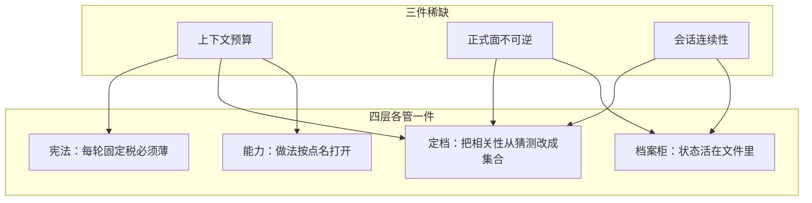
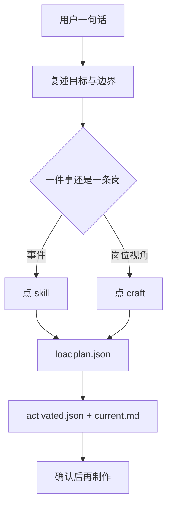
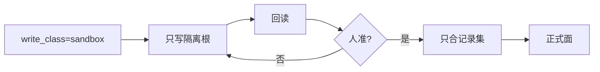
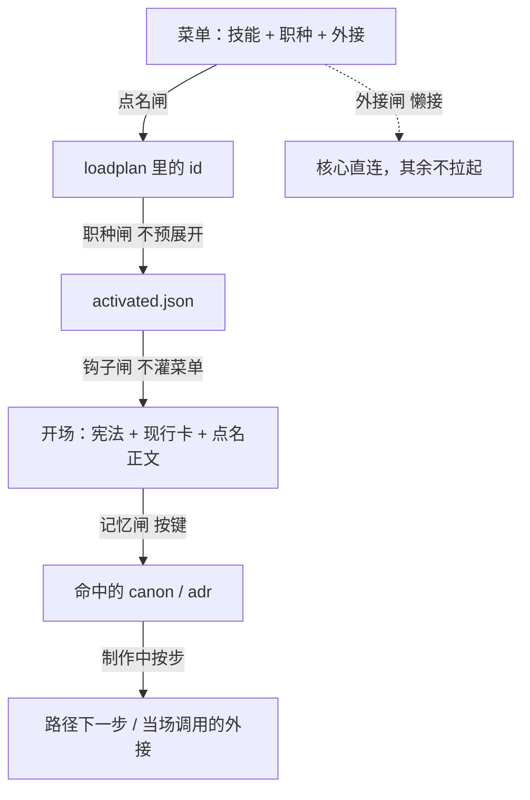

# Game Studio Harness

游戏制作里，代理缺的不是更多技能文件。缺的是三件事被管住：

1. **窗口是稀缺的。** 做法可以有一百份，一轮对话装不下。
2. **正式面是不可逆的。** 表、主仓、引擎内容被整本覆盖，比答错一题贵。
3. **会话会断。** 换人、换窗口、换工具之后，下一手必须能从文件接着做。

本仓用封版的四层来管这三件事。仓根上五套工具目录各自齐套（技能、职种、宪法都在里面，冗余没关系）。打开 `cursor/` 或 `claude/` 就能看到完整包，不必再进一层适配夹。

| 职种 | 技能 | 外接 | 齐套目录 |
| ---: | ---: | ---: | ---: |
| 35 | 106 | 36 | cursor · claude · codex · grok · deepseek |



---

## 仓根怎么排

```text
README.md              本文件：思路、逻辑、部署，都写在这里
AGENTS.md / CLAUDE.md  打开本仓时给 Codex / Claude 读的短入口
cursor/                Cursor 完整包（规则、技能、职种、钩子、菜单）
claude/                Claude Code 完整包
codex/                 Codex 完整包
grok/                  Grok Build 完整包
deepseek/              DeepSeek Harness 完整包
studio/                业务根 .harness 模板
docs/tools/            外接要装哪些软件
scripts/               安装与验收
一键部署.bat
```

每套目录自己就够用。安装器按 `--tools` 把对应目录拷到本机家目录。

---

## 为什么是四层

若合成三层，常见塌法是：宪法里塞做法，或做法目录自己当导演。结果是每轮读完全部技能，或者没有人负责「这一轮到底点谁」。

若拆成五层以上，多出来的往往只是落点名字。落点会变，运转法不该变。所以 Cursor / Claude / Codex / Grok / DeepSeek 是**同一套四层的五份齐套拷贝**，不是第五层。

| 层 | 只回答 | 不回答 |
|---|---|---|
| 宪法 | 无论做什么都不能忘的运转 | 这件事具体怎么做 |
| 定档 | 这一轮点谁、写到哪、怎么收口 | 伤害公式怎么写 |
| 能力 | 可复用做法和岗位路径 | 当次数字、当次路径 |
| 档案柜 | 做到哪、正式面在哪、哪句已批准 | 自动推理「上次为什么」 |

封版：任务再多，也不许沿旧名单再加一层来「顺便」解决问题。要改分层，先转向、改计划、写决策。

---

## 第一层：始终生效，所以必须拒绝变厚

第一层每轮都会进窗口。写进去的每一段都是**固定税**。税越重，留给本轮做法的预算越少。设计动作主要是拒绝：

- 拒绝把技能步骤写进宪法。
- 拒绝把菜单、职种列表、外接工具表当开场读物。
- 拒绝把当次项目名、当次数字写进可复用正文。

留下的只有运转不变量：生命周期、开场读序、名单语义、会话种类、写隔离、封版。

开场读序写成一条链，顺序就是优先级：


先稳住「怎么运转」和「正在做哪件」，再打开做法，最后按键取已批准事实。倒过来会被技能细节带走，丢掉本轮边界。

续 / 转向 / 插队 / 新 / 并行 / 讨论保护的是**上下文集合的稳定性**：同一未关目标可以增量点名；口径变了必须先改计划；另一件插进来时旧件不关，只标已停。

---

## 第二层：导演，不是又一个工人

不经定档时，模型会做三件有害的事：把「可能相关」的做法都打开、同时扮演几个岗位、直接改它看得到的正式文件。

第二层把「相关性」从模型猜测改成**显式集合**。导演不生产业务文件。它只决定：目标是什么、点哪些 id、写级别是什么、下一手看哪张卡。

计划里每一项都是开场税，所以点名有硬约束：

- 一件事一个主事件，**或**一条职种主路径，二者只取其一。
- `why` 至少 8 字，名单才可审计。
- 外接只点开场必须握手的。
- 菜单没有 id：先补能力，再定档。不现场发明 id。



职种正文是**路径（序列）**。若把 `uses_skills` 一次性写入名单，代理会同时用第一步和最后一步的口径说话。所以点职种只注入职种正文 + `craft_open`（第一步）。做到那一步，再打开那份技能。

`tier` 决定结案核多少证据，不决定开场读多少技能。岗位不同时按职种开子代理：专注度的边界是岗位，不是提示词里的「请专注」。主会话点名和收口。

---

## 第三层：能力在库里，注入在名单里

106 份技能、35 条职种、36 条外接是**库**。开场读的是库的一个切片。

`activated.json` 只回答「开场先注入谁」。它不是防火墙。过程中缺技能就当场打开，缺外接就当场调用。若做成运行时硬闸，导演会被迫预点「可能用到的一切」，第一层的薄就被废掉。

| | 开场 | 过程中 |
|---|---|---|
| 技能 / 职种 | 只读点名 | 可再打开 |
| 外接 | 只提示 `mcp_allow` | 可再调用 |
| 记忆 | 只读 `retrieve_keys` 命中 | 新事实先写产物，批准后再进 canon |

三种粒度不能合成一种：技能是一件事，职种是一条岗的走法，外接是宿主的手。软件可以不在，架构仍应能转。

三十六条外接若开场全连，发现阶段会被空等吃掉。默认核心直连、其余懒接。缺宿主红灯表示软件没装，不表示四层没落地。

---

## 第四层：档案柜，承认自己不会推理

图谱承诺「能连上上次为什么那样定」。做不到时，讨论、猜想、已批准事实会被拌在一起引用。档案柜只承诺更少的事：

- `state.json`：正在哪次会话
- `current.md`：目标、禁改、下一手
- `surfaces.json`：官方根和隔离根
- `tasks.jsonl`：只追加的流水
- `canon/` `adr/`：必须被键命中才打开

读当前行，写回当前行。日期只进当前行和流水。

写隔离是牙齿。默认 `write_class=sandbox`：表进同级沙箱，代码进 worktree，引擎进沙盒根，草稿进 `_Dev`。晋升须人准，且只回写记录集。并行会话都写隔离根，正式面只在人准的那一下变化。



`retrieve_keys` 把记忆变成寻址。没有键就不打开 canon，避免先扫全库再决定相关。

---

## 五道闸怎么合成专注度

专注度不是提示词。它是本轮正文集合可预期。



续做时集合稳定。转向时先改计划再换集合。插队时旧集合停在旧会话目录里。

---

## 针对过的失败模式

| 失败 | 哪一层接住 |
|---|---|
| 每轮把全部技能读一遍 | 宪法拒绝灌菜单；定档点名；能力切片注入 |
| 一只代理又改表又写客户端又验收 | 定档按岗开子代理 |
| 职种一点就预读整条路径 | `craft_open` 只带第一步 |
| 直接改正式表整本 | 写级别 + 隔离根 |
| 换窗口后不知道做到哪 | 现行卡 / 当前行 |
| 把口头想法当成已批准 | canon 必须晋升 |
| 开场卡在三十个 MCP 握手 | 外接档位 |
| 任务中途偷偷加第五层 | 封版 |

制作流水线（方向、规则、数字、体验、资产、引擎、权威、验收、运营）被托住的方式，是每段都有岗可点、有技能可按步打开。

---

## 一键部署

Windows + Python 3.11+。再装你实际用的工具（可只装一部分）。

1. 克隆本仓。
2. 双击 `一键部署.bat`，填写业务根。
3. 看到 `ok architecture install`。
4. 打开业务根，改 `.harness/surfaces.json`。
5. 写 `.harness/sessions/<短名>/loadplan.json`，跑：

```text
python %USERPROFILE%\.gsh\harness\scripts\生成会话能力名单.py <短名>
```

```powershell
.\一键部署.ps1 -Workspace D:\MyStudio
.\一键部署.ps1 -Workspace D:\MyStudio -Tools cursor,claude
```

| 目录 | 装到 |
|---|---|
| `cursor/` | `~/.cursor` |
| `claude/` | `~/.claude` |
| `codex/` | `~/.codex`、`~/.agents/skills` |
| `grok/` | `~/.grok` |
| `deepseek/` | `~/.dsh` |

共享运行时 `~/.gsh`。已有 `mcp.json` 不覆盖。本包装架构文件，不装 Excel / Unity / DCC。软件清单在 `docs/tools/总览.md`。

探测（不写真实用户目录）：

```powershell
python scripts/install.py --isolate-root D:\probe --workspace D:\probe\ws --tools all
python scripts/verify_install.py --isolate-root D:\probe --workspace D:\probe\ws
```

给部署代理：先跑安装器，不要先改业务仓，不要装 DCC。禁止 `--write-mcp` 覆盖已有 `mcp.json`。

## 许可

MIT。
