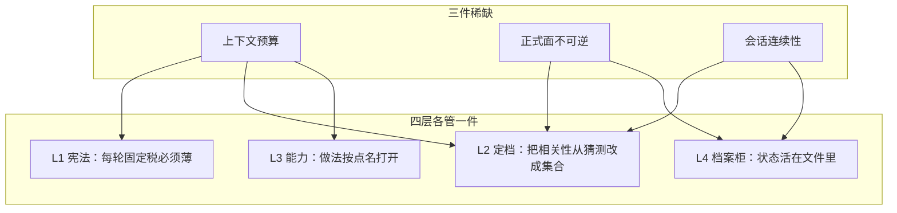
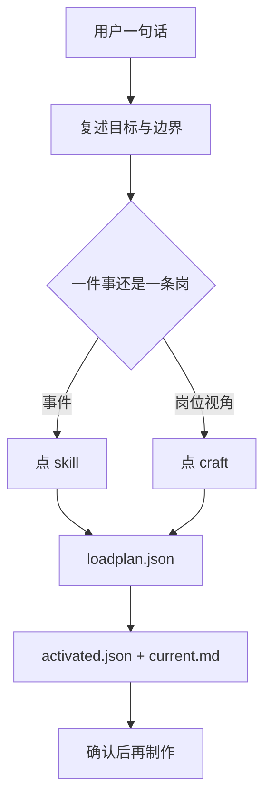
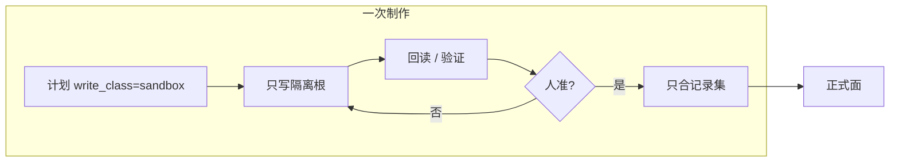
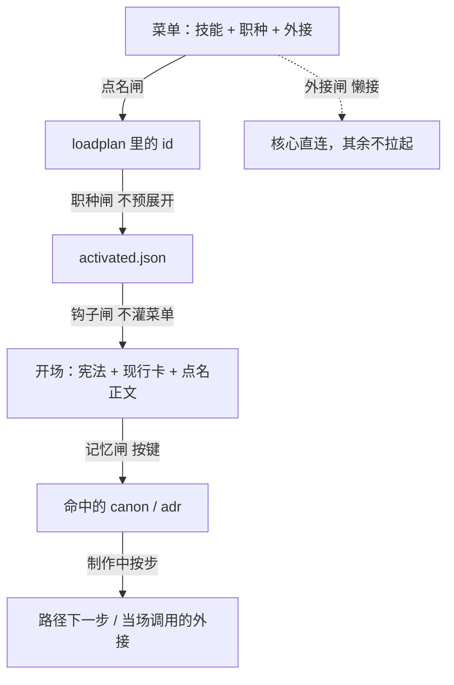

# 架构拆解

这套东西要回答的不是「技能文件怎么堆」，而是三个更硬的问题：

1. **窗口是稀缺的。** 做法可以有一百份，一轮对话装不下。
2. **正式面是不可逆的。** 表、代码主仓、引擎内容被整本覆盖，比答错一题贵。
3. **会话会断。** 换人、换窗口、换工具之后，下一手必须能从文件接着做。

四层是对这三个稀缺量的分工，不是目录编号。下面按「设计时拒绝了什么」来拆，而不是按文件清单复述。

---

## 1. 为什么是四层

若合成三层，常见塌法是：宪法里塞做法，或做法目录自己当导演。结果是每轮都读完全部技能，或者没有人负责「这一轮到底点谁」。

若拆成五层以上，多出来的往往是**落点**（Cursor 家目录、Claude 家目录）。落点会变，运转法不该变。所以适配不是第五层。

四层各自只回答一个问题：

| 层 | 只回答 | 不回答 |
|---|---|---|
| 宪法 | 无论做什么都不能忘的运转 | 这件事具体怎么做 |
| 定档 | 这一轮点谁、写到哪、怎么收口 | 伤害公式怎么写 |
| 能力 | 可复用做法和岗位路径 | 当次数字、当次路径 |
| 档案柜 | 做到哪、正式面在哪、哪句已批准 | 自动推理「上次为什么」 |

封版的含义：任务再多，也不许沿旧名单再加一层来「顺便」解决问题。要改分层，先转向、改计划、写决策。

---

## 2. 第一层：始终生效，所以必须拒绝变厚

### 力学

第一层每轮都会进窗口。写进去的每一段，都是**固定税**。税越重，留给本轮做法的预算越少。所以第一层的设计动作主要是**拒绝**：

- 拒绝把技能步骤写进宪法。
- 拒绝把菜单、职种列表、外接工具表当开场读物。
- 拒绝把当次项目名、当次数字写进可复用正文。

留下的只有运转不变量：生命周期、开场读序、名单语义、会话种类、写隔离、封版。

### 开场读序为什么写成一条链

顺序本身就是优先级。先稳住「怎么运转」和「正在做哪件」，再打开做法，最后按键取已批准事实。倒过来就会先被技能细节带走，丢掉本轮边界。

### 会话分类在保护什么

续 / 转向 / 插队 / 新 / 并行 / 讨论，不是流程装饰。它们保护的是**上下文集合的稳定性**：

- 同一未关目标：名单可以增量，不必重开一套身份。
- 口径变了：必须先改计划。否则旧点名会把代理锁在过期的做法上。
- 另一件插进来：旧件不关，只标已停。状态不能靠「我们聊到哪了」。

第一层很薄，正是为了让第二层的点名成为真正的变量。

---

## 3. 第二层：导演，不是又一个工人

### 代理的默认行为

不经定档时，模型会做三件对我们有害的事：把「可能相关」的做法都打开、同时扮演几个岗位、直接改它看得到的正式文件。

第二层把「相关性」从模型猜测改成**显式集合**。导演不生产业务文件。它只决定：目标是什么、点哪些 id、写级别是什么、下一手看哪张卡。

### 点名为什么是控制面

计划里的每一项都是「开场税」。所以点名有硬约束：

- 一件事一个主事件，**或**一条职种主路径，二者只取其一。两个都点，等于同一段工作交两份税。
- `why` 至少 8 字。逼迫把「为什么是这个 id」写出来，名单才可审计。
- 外接只点开场必须握手的。其余用到再调，不必为放行改计划。
- 菜单没有 id：先补能力，再定档。现场发明 id 会让下一手找不到正文。

### 职种不预展开

职种正文描述的是路径，路径是**序列**。若把 `uses_skills` 一次性写入 `activated.skills`，等于把这条岗的十个步骤当成集合预读。代理会同时用第一步和最后一步的口径说话。

所以点职种只注入：职种正文 + `craft_open`（第一步）。做到那一步，再打开那份技能。专注度来自「当前只允许一条步骤在窗口里当主角」。

### 档位不管灌入

`tier` / `verify_kind` 决定结案核多少证据，不决定开场读多少技能。短活也可以点很多技能，那是点名出错，不是档位出错。反过来，T3 也不该为了「显得完整」把菜单灌进开场。

### 子代理按岗切

岗位职责不同时，主会话串演会把两套术语、两套正式面揉进同一窗口。优先按职种各开一只子代理：专注度的边界是**岗位**，不是提示词里的「请专注」。主会话负责点名和收口。

---

## 4. 第三层：能力在库里，注入在名单里

### 注入 ≠ 能力

第三层可以很大：106 份技能、35 条职种、36 条外接。这是**库**。开场读的是库的一个切片。

`activated.json` 只回答「开场先注入谁」。它不是防火墙。过程中缺技能，当场打开；缺外接，当场调用。若把它做成运行时硬闸，导演层会被迫预点「可能用到的一切」，第一层的薄就被废掉。

这个不对称是故意的：

| | 开场 | 过程中 |
|---|---|---|
| 技能 / 职种 | 只读点名 | 可再打开 |
| 外接 | 只提示 `mcp_allow` | 可再调用 |
| 记忆 | 只读 `retrieve_keys` 命中 | 新事实先写产物，批准后再进 canon |

### 三种粒度为什么不能合成一种

- **技能**：一件事的做法。适合「我知道要做导入校验」。
- **职种**：一个岗位怎么从头走到收口。适合「用战斗数值的视角做完这一段」。
- **外接**：宿主软件的手。和做法正文分开，是因为软件可以不在，架构仍应能转。

合成一种（全是 slash command，或全是 agent）会丢掉「按步打开」或丢掉「岗位视角」。

### 外接档位管的是另一种税

外接工具表很大，宿主冷启动更贵。三十六条若开场全连，发现阶段会被空等吃掉。所以默认：日常核心直连，其余懒接。缺宿主红灯，表示软件没装，不表示四层没落地。

---

## 5. 第四层：档案柜，承认自己不会推理

### 为什么不是图谱

图谱承诺「能连上上次为什么那样定」。做不到时，代理会把讨论、猜想、已批准事实拌在一起引用。档案柜只承诺更少的事：

- 当前行告诉你正在哪次会话。
- 现行卡告诉你目标、禁改、下一手。
- 正式面地图告诉你官方根和隔离根。
- 流水只追加，不改写历史。
- canon / adr 必须被键命中才打开。

读当前行，写回当前行。日期只进当前行和流水，避免技能正文被日期污染。

### 写隔离是第四层的牙齿

`write_class` 在定档里选定，在档案柜里落地。默认 `sandbox`：表进同级沙箱，代码进 worktree，引擎进沙盒根，草稿进 `_Dev`。晋升须人准，且只回写记录集。

这不是流程礼貌。并行会话若都写正式面，不可逆风险接近叠加；都写隔离根，正式面只在人准的那一下变化。

### 记忆按键，不是检索

`retrieve_keys` 把记忆变成寻址。没有键就不打开 canon。这避免「先扫全库再决定相关」——那会把第四层又灌回第一层的税里。

---

## 6. 五道闸怎么合成专注度

专注度不是提示词。它是本轮正文集合可预期。

续做时集合稳定。转向时先改计划，再换集合。插队时旧集合停在旧会话目录里，不被新窗口覆盖。

---

## 7. 针对过的失败模式

| 失败 | 哪一层接住 |
|---|---|
| 每轮把全部技能读一遍 | L1 拒绝灌菜单；L2 点名；L3 切片注入 |
| 一只代理又改表又写客户端又验收 | L2 按岗开子代理 |
| 职种一点就预读整条路径 | L3 `craft_open` |
| 直接改正式表整本 | L2 写级别 + L4 隔离根 |
| 换窗口后不知道做到哪 | L4 现行卡 / 当前行 |
| 把口头想法当成已批准 | L4 canon 必须晋升 |
| 开场卡在三十个 MCP 握手 | L3 外接档位 |
| 任务中途偷偷加第五层 | L1 封版 |

制作流水线（方向、规则、数字、体验、资产、引擎、权威、验收、运营）被托住的方式，是**每段都有岗可点、有技能可按步打开**，不是另做一套引擎教程层。

---

## 8. 和仓内目录怎么对应

概念四层封版。仓内按**用途**分：一份正文，五套落点。见仓库根 README。
