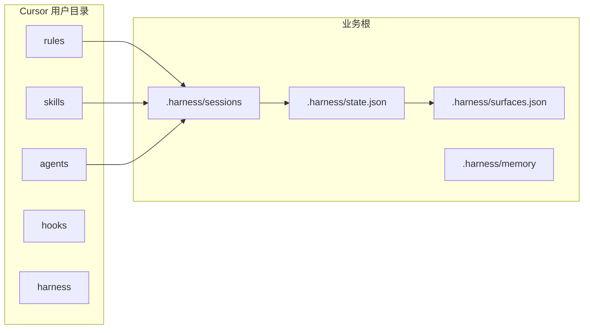

# 架构与文件分档

四层是**概念**。仓内目录按 **AI 编程工具（Cursor）真实落点**分档，避免再出现 `L1` `L2` 这种搬运编号夹。

## 概念四层

| 层 | 职责 | 仓内 | 装到 |
|---|---|---|---|
| L1 宪法 | 始终生效 | `cursor/rules/` | `~/.cursor/rules/` |
| L2 定档 | 点名、现行卡、写级别 | 技能 `route-task` + 业务根会话 | `<业务根>/.harness/sessions/` |
| L3 能力 | 技能、职种、外接桩 | `cursor/skills/` `agents/` `harness/` | `~/.cursor/skills/` `agents/` `harness/` |
| L4 档案柜 | 当前行、正式面、流水 | `workspace-scaffold/` | `<业务根>/.harness/` |

`activated.json` 只决定开场注入哪些正文，**不是运行时防火墙**。职种点名不预展开路径技能。



## 仓内树

```text
game-studio-harness/
  README.md                 入口
  自述.md                   用途、目的、优劣势
  一键部署.bat / .ps1
  install.py                安装器
  verify_install.py         验收（不要求软件健康）
  cursor/
    rules/                  宪法
    skills/<id>/SKILL.md    事件
    agents/<id>.md          职种
    hooks/ + hooks.json
    mcp.json.example        无密钥骨架
    harness/
      scripts/              刷新菜单、生成名单、接线
      mcp-tools/            每个 MCP 的用途桩
      mcp-boot/             懒接与 HTTP 桥
      mcp-tiers.json        核心 / 懒接
      surfaces.default.json
  workspace-scaffold/.harness/
  docs/
    架构.md
    部署指南.md
    图表/*.svg
    工具/                   软件清单与用法
```

## 写隔离

默认 `write_class=sandbox`。`surfaces.json` 把每种正式面映射到隔离根：

- 表：正式表同级沙箱副本
- 代码：worktree
- 引擎：引擎沙盒根
- 草稿：`_Dev`

晋升须人准，只回写记录集，禁止整文件覆盖正式面。

## 改架构

四层已封版。要加层或改导演口径：先转向、改计划、写决策。不要沿旧名单加第五层。
