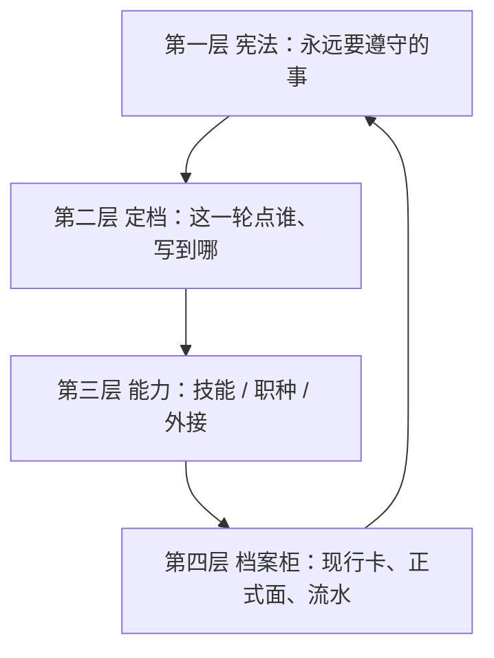
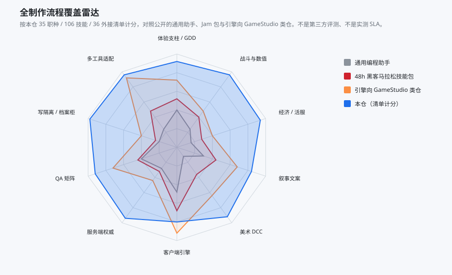

# 架构思路

本仓要解决的不是「再多写一些技能文件」，而是：代理在做游戏时，**每一轮该记住什么、该打开哪份做法、可以改哪里、做完怎么留下下一手能接着干的状态**。

四层是概念，已经封版。仓内目录按工具落点分档，不再用 `L1` 这种搬运夹名。改分层须转向、改计划、写决策。



开场读序固定为：

**宪法 → 现行卡 → 名单里点名的技能/职种正文 → `retrieve_keys` 命中的已批准事实/决策。**

不要把菜单全文灌进窗口。开场钩子只注入现行卡摘要和点名列表。

---

## 第一层：宪法

### 设计问题

如果把纪律写在某次对话里，换会话、换人、换工具就会丢。如果把所有做法都写进「始终生效」，窗口会被撑满，代理反而无法专注当前这件事。

第一层只回答：**无论本轮做什么，都不能忘的运转规则。** 具体「怎么改一张表」「怎么挂一个 Hit 帧」不属于这一层。

### 这一层写什么

1. **生命周期**：定档 → 制作 → 结案。同一未关目标续同一会话。
2. **开场读序**：先读宪法和现行卡，再读点名正文，最后按键取记忆。禁止把 catalog 当开场读物。
3. **名单语义**：`activated.json` 只决定**开场先注入哪些正文**，不是运行时防火墙。过程中缺技能或外接，当场打开或调用，不必先改计划重生名单。
4. **会话种类**：续、转向、插队、新、并行、讨论。口径变了必须先改计划，禁止沿旧名单做完。
5. **写与晋升**：默认进隔离根；人准后只回写记录集。
6. **正文边界**：技能/职种/规则只写可复用做法。当次诉求写在 `why`、现行卡和产物里。
7. **封版**：四层本身不再随任务加层。

### 为什么要薄

宪法每轮都会进上下文。写厚等于每轮交固定税。所以第一层压成「运转法」，做法正文放到第三层，按点名再打开。

落地文件：Cursor 用 `rules/全局.mdc`（始终生效）；Claude / Codex / Grok / DeepSeek 用短宪法 `CLAUDE.md` / `AGENTS.md`。内容同一套，只是各工具的入口文件名不同。

---

## 第二层：定档

### 设计问题

用户一句话里常常混着几个岗位、几种写权限、几种收口标准。若不先拆，代理会同时扮演数值、程序和测试，并把整本技能库当作相关。

第二层是导演，不生产业务文件。它只做四件事：**复述目标、点名、定写级别、写下现行卡。**

### 点名逻辑

把诉求拆成可执行事件，对照菜单选 id：

| 点什么 | 何时 | 开场注入什么 |
|---|---|---|
| `skill` | 这件事有明确做法 | 该技能一份 `SKILL.md` |
| `craft` | 需要这个岗位的主路径或视角 | 职种正文 + `craft_open`（路径**第一步**） |
| `mcp` | 开场就要握手的外接 | 只进 `mcp_allow` 提示，不挡后来的调用 |

约束：

- 一件事一个主事件，或一条职种主路径，二者只取其一，避免又点技能又点整条职种造成双份灌入。
- 每项 `why` 至少 8 字，对不上就换 id。
- 岗位职责不同时，优先按职种开子代理，主会话点名与收口，不在一只代理里串岗。
- 菜单没有 id：先补技能/职种/外接，再定档。不现场发明 id。

### 计划与现行卡

计划写在 `.harness/sessions/<短名>/loadplan.json`。必填：`session_id`、`tier`、`items`、`verify_kind`、`intent`、`work_mode`。建议加 `write_class`、`retrieve_keys`、`forbid`。

生成名单后写出 `activated.json` 和 `current.md`。现行卡给下一手看：目标、进度、正式面/隔离根、已点名、禁改、下一手。**下一手不靠聊天记录续命。**

`intent` 先判再写计划：续、转向、插队、新、并行、讨论。做法已知就留在制作；做法分叉才切计划模式。

### 档位与收口

档位决定结案时核多少证据，不决定开场灌多少技能。

| 档 | 核什么 |
|---|---|
| 讨论 | 不写报告 |
| T0 | 1 条主产物 |
| T1 | 主产物 + 关键约束 |
| T2 | 再加跨职种接口 |
| T3 | 再加构建或发版 |

有交付则写验证报告。`verdict` 为通过后再关项，并回写当前行与任务流水。

---

## 第三层：能力，以及上下文如何被管住

### 设计问题

游戏制作的可复用做法很多：属性框架、伤害公式、导入校验、战斗权威、活动邮件……若每轮全开，代理会失焦；若完全不写，又会每轮重发明做法。

第三层把能力拆成三种粒度，**按点名进入窗口**。

### 三种正文

| 种类 | 一份是什么 | 专注手段 |
|---|---|---|
| 技能 | 一件事怎么做 | 只打开本轮点名的那几份 |
| 职种 | 这个岗位的主路径 | 不预展开路径上的技能，只带 `craft_open` |
| 外接 | 宿主软件的接线 | 开场只点必须握手的；其余懒接，用到再调 |

技能写可复用步骤，不写当次数字。当次诉求留在计划的 `why` 和产物里。

职种点名后：开场读职种正文，知道路径第一步是谁；做到那一步再打开那份技能。禁止把 `uses_skills` 整条写进 `activated.skills`。

外接分档：日常核心直连（默认 Excel），其余启动时不拉起宿主。缺软件时健康检查可以红，**不算架构没装上**。

### 注入与专注度：五道闸

窗口里的东西由下面五道闸共同收窄。名单不是调用闸——代理过程中仍可打开未点名的技能，只是开场不预交税。

```text
菜单（106 技能 + 35 职种 + 36 外接）
        │  第二层点名
        ▼
activated.json  ← 只含本轮 id
        │  职种不预展开
        ▼
开场正文 = 宪法 + 现行卡 + 点名 SKILL/职种
        │  retrieve_keys
        ▼
记忆 = 命中的 canon / adr，不扫全库
        │  制作中按步打开
        ▼
路径下一步技能 / 当场调用的外接
```

1. **点名闸**：没写进计划的技能，开场不读。
2. **职种闸**：路径技能按步打开，避免一条职种把十份做法一次性铺开。
3. **记忆闸**：只按 `retrieve_keys` 打开已批准事实，不把档案柜当向量库全扫。
4. **钩子闸**：开场钩子注入现行卡摘要和点名列表，明确写「不要灌菜单全文」。
5. **外接闸**：工具表很大；核心直连、其余懒接，避免发现阶段被空等宿主占满。

这样「专注度」不是靠提示词喊「请专注」，而是靠**本轮正文集合可预期**：同一交付续做时名单稳定；转向时先改计划再换集合。


上图是架构对比模型：若把本仓全部技能/职种/外接工具表每轮灌入，占用会顶满窗口；按点名注入则增长率停在还能工作的区间。不是某台机器的 profiler。


外接同理：三十六条若启动全连，发现阶段会被空等拖长；核心直连、其余懒接，开场只付握手代价。

---

## 第四层：档案柜

### 设计问题

制作状态若只活在对话里，换一只代理就断。若做成知识图谱，又会和「当次事实 / 已批准事实」搅在一起，代理分不清哪句能当依据。

第四层是**档案柜加流水，不是知识图谱**。读当前行，写回当前行；流水只追加。

| 表 | 作用 |
|---|---|
| `state.json` | 当前行：正在哪次会话 |
| `sessions/<短名>/current.md` | 现行卡 |
| `surfaces.json` | 正式面 ↔ 隔离根 |
| `memory/tasks.jsonl` | 任务流水，只追加 |
| `memory/canon/` | 已批准、可复用的事实 |
| `memory/adr/` | 架构/技术决策 |
| `artifacts/index.jsonl` | 产物索引 |
| `artifacts/<工作项>/verify-report.json` | 关项验证 |

开场读现行卡和当前行。生成名单时回写会话与当前行。结案追加流水。日期时刻只写进当前行和任务流水，避免技能正文被日期污染。

记忆检索必须带键：先现行卡，再计划里的 `retrieve_keys`，只打开命中条目。

### 写隔离（和第四层绑在一起）

`surfaces.json` 给每一种正式面准备隔离根。默认 `write_class=sandbox`。

| 面 | 隔离怎么落 |
|---|---|
| 表 | 正式表同级沙箱副本，晋升只合记录格 |
| 代码 | worktree |
| 引擎 | 地图里的引擎沙盒根 |
| 草稿 | `_Dev`，不进发包 |

晋升须人准，禁止整文件覆盖正式面。并行会话各自写隔离根，正式面误写风险不随会话数叠加。


---

## 制作流水线怎么被这四层托住

四层不规定你做什么游戏，但规定**岗位怎么被点到、做法怎么按步打开**。职种覆盖制作、策划、数值、叙事、美术、程序、测试、活服。点职种 = 换视角并走主路径，不是把该岗所有技能预读完。




雷达按本仓职种/技能/外接清单，看九段制作面各自有没有岗可点。缺的是工作室自己的表和工程，不是「没有这个岗位的做法」。

---

## 多工具只是落点

技能正文只存一份。安装器先拷到 `~/.gsh`，再镜像到 Cursor / Claude Code / Codex / Grok / DeepSeek Harness 各自的家目录。详见 [适配.md](适配.md)。

适配不是第五层。换工具不换四层口径。

---

## 仓内树

```text
cursor/                 唯一正文：规则、技能、职种、钩子、菜单
adapters/               各工具落点注册
workspace-scaffold/     业务根档案柜模板
docs/图表/              注入、隔离、覆盖的示意
docs/工具/              外接要装什么、怎么用
```
