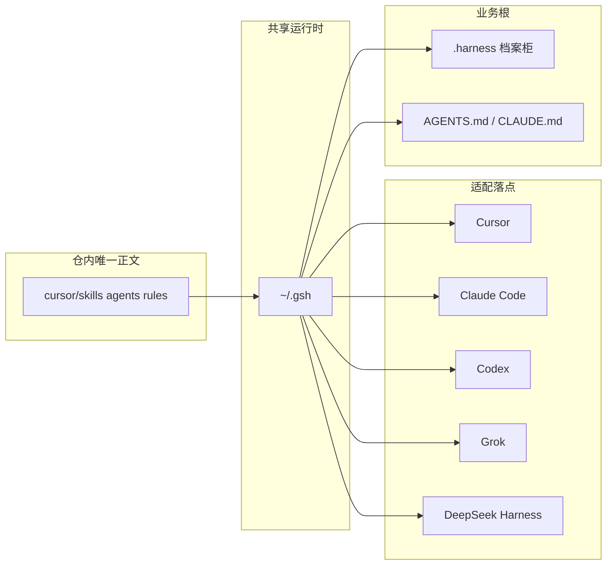

# 架构与文件分档

四层是**概念**，已封版。仓内目录按 **AI 编程工具真实落点**分档：一份正文，五套适配。

## 概念四层

| 层 | 职责 | 仓内 | 装到 |
|---|---|---|---|
| L1 宪法 | 始终生效 | `cursor/rules/` + `adapters/_shared/CONSTITUTION.md` | 各工具的 rules / CLAUDE.md / AGENTS.md |
| L2 定档 | 点名、现行卡、写级别 | 技能 `route-task` + 业务根会话 | `<业务根>/.harness/sessions/` |
| L3 能力 | 技能、职种、外接桩 | `cursor/skills/` `agents/` `harness/` | `~/.gsh` 再镜像到各工具 |
| L4 档案柜 | 当前行、正式面、流水 | `workspace-scaffold/` | `<业务根>/.harness/` |

`activated.json` 只决定开场注入哪些正文，**不是运行时防火墙**。职种点名不预展开路径技能。



## 仓内树

```text
game-studio-harness/
  README.md
  自述.md
  AGENTS.md                 仓根宪法，给 Codex / Grok / DSH 直接读
  一键部署.bat / .ps1
  install.py
  verify_install.py
  cursor/                   唯一技能/职种/钩子/菜单正文
  adapters/registry.json    五套工具落点
  adapters/_shared/         短宪法
  workspace-scaffold/
  docs/
```

## 写隔离

默认 `write_class=sandbox`。`surfaces.json` 把每种正式面映射到隔离根：

- 表：正式表同级沙箱副本
- 代码：worktree
- 引擎：引擎沙盒根
- 草稿：`_Dev`

晋升须人准，只回写记录集，禁止整文件覆盖正式面。

## 改架构

四层已封版。要加层或改导演口径：先转向、改计划、写决策。不要沿旧名单加第五层。多工具适配是落点，不是第五层。
