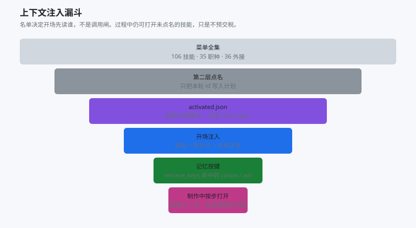
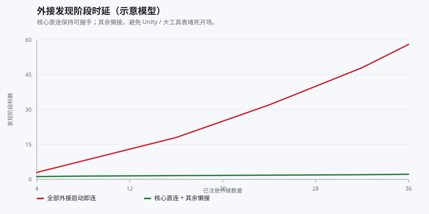
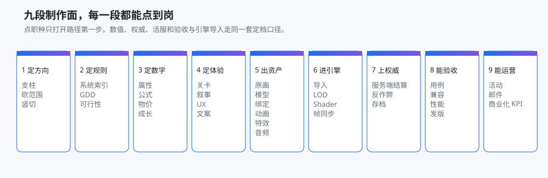

# 自述

本文说明这套平台**是干什么的、四层为什么这样拆、值不值得上**。设计细节看 [docs/架构.md](docs/架构.md)，部署看 [README.md](README.md)。

## 用途

给已经在用 AI 编程工具做游戏的团队，提供一套可搬家的制作操作系统：

- **宪法**管永远要遵守的运转法，不用每轮重说。
- **定档**管这一轮点谁、写到哪、怎么收口。
- **技能 / 职种 / 外接**管可复用做法，按点名打开。
- **档案柜**管当前做到哪、正式面在哪、上次验证过什么。下一手不靠聊天续命。

它不是引擎，不是数值表，不是美术管线软件。那些仍用你现有的 Unity / Unreal / Excel / DCC。本仓只部署「代理怎么工作」的文件。

## 目的

1. **换人、换会话、换机器、换工具仍能接着做。** 现行卡写在业务根。
2. **控制上下文。** 开场只注入点名正文，不把一百多个技能全部塞进窗口。
3. **控制专注度。** 职种不预展开；岗位不同就开子代理；记忆按键取。
4. **控制写权限。** 默认写隔离根；晋升须人准，只回写记录集。
5. **控制外接。** 核心直连，其余懒接。
6. **可对外复制。** 去掉项目名、本机路径和密钥后，别人可以一键落到自己的工具链。

## 四层各自在解决什么

### 第一层：宪法为什么必须薄

每轮都会读。写厚等于每轮交固定税。所以这里只放运转法：生命周期、开场读序、名单不是调用闸、会话种类、写隔离、封版。

「怎么填一条伤害公式」不进宪法。那是第三层某份技能的事。

### 第二层：先导演，再动手

用户一句话里常常混着几个岗位和几种写权限。不定档就会串岗、灌库、直接改正式面。

定档只做：复述、点名、定写级别、写现行卡。计划进 `loadplan.json`，名单进 `activated.json`。确认后再制作。口径变了先改计划，禁止沿旧名单做完。

### 第三层：能力按点名进窗口

技能 = 一件事一份做法。职种 = 一条主路径，开场只带第一步。外接 = 宿主接线，开场只点必须握手的。

名单决定**开场先读谁**，不挡住过程中再打开。这样既不会把 106 份做法预交税，也不会把未点名的技能锁死。

五道闸一起收窄窗口：点名、职种不预展开、`retrieve_keys`、开场钩子不灌菜单、外接懒接。详见 [架构.md](docs/架构.md#第三层能力以及上下文如何被管住)。

### 第四层：档案柜，不是图谱

当前行、现行卡、正式面地图、只追加的流水、按键打开的 canon/adr。代理分得清「正在做哪件」和「哪句已经批准」。不会假装能推理「上次为什么那样定」。

## 这些闸在压什么

图是架构模型或清单计数，不是实测 SLA。

制作面上，职种按流水线铺开，点岗即可走主路径：

硬数来自仓内清单：35 职种、106 技能、36 外接。缺的是你工作室自己的表和工程。

## 优劣势

### 优势

| 点 | 说明 |
|---|---|
| 运转可审计 | 规则、计划、名单、现行卡都在文件里，能 diff。 |
| 上下文可预期 | 本轮正文集合由点名决定；转向先改计划。 |
| 专注有结构 | 职种按步打开，子代理按岗拆，记忆按键取。 |
| 写隔离是默认 | 表 / 代码 / 引擎 / 草稿走同一张地图。 |
| 外接可降级 | 无软件机也能把架构落地。 |
| 一份正文多部落点 | 换 AI 编程工具不换四层口径。 |

### 劣势

| 点 | 说明 |
|---|---|
| 前置成本 | 要会写加载计划、改 `surfaces.json`，第一周比直接聊天重。 |
| 软件要另装 | 一键部署不装 Excel / Unity / DCC。 |
| 各工具运行时不对称 | 宪法相同；钩子和外接档位在 Cursor 上最完整。 |
| 不是知识图谱 | 档案柜不会自动归纳「为什么」。 |
| 封版约束 | 改四层必须转向、改计划、写决策。 |
| 示意不是 SLA | 曲线说明闸的形状；秒数看你的宿主。 |
| 中文路径 | 非 UTF-8 终端要注意编码。 |

### 什么时候不该上

- 只要一次性改几行代码，没有持续制作会话。
- 团队不接受「先定档再写」。
- 需要的是引擎或数值中台本身，而不是代理怎么工作。

## 推荐阅读序

1. 本文：用途与取舍
2. [docs/架构.md](docs/架构.md)：四层设计逻辑
3. [docs/适配.md](docs/适配.md) 与 [docs/部署指南.md](docs/部署指南.md)
4. [docs/工具/总览.md](docs/工具/总览.md)
5. 打开业务根，写第一份 `loadplan.json`
